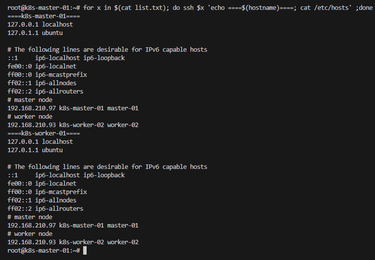

# provisioning-k8s-old using CRI Docker
Ini adalah cara install k8s versi lama, karena saat ini versi lama k8s sudah tidak dukung langsung oleh kubernetes dan reponya sudah di hapus juga

- create file hosts

```sh
cat <<"EOF"> hosts.txt
# master node
192.168.210.97 k8s-master-01 master-01
# worker node
192.168.210.93 k8s-worker-02 worker-02
EOF
```

```sh
cat <<"EOF"> list.txt
192.168.210.97
192.168.210.93
EOF
```

```sh
for x in $(cat list.txt); do scp hosts.txt $x:~/ ;ssh $x 'echo ====$(hostname)====; cat ~/hosts.txt >> /etc/hosts'; done
```

- verify
```sh
for x in $(cat list.txt); do ssh $x 'echo ====$(hostname)====; cat /etc/hosts' ;done
```

<details><summary>Image Verify</summary>



</details>

- Donwload binary

### <summary>install_binary.sh</summary>

```bash
#!/bin/bash

# enable routing
cat <<EOF | sudo tee /etc/sysctl.d/99-kubernetes-cri.conf 
net.bridge.bridge-nf-call-iptables = 1 
net.ipv4.ip_forward = 1 
net.bridge.bridge-nf-call-ip6tables = 1 
EOF

sudo sysctl --system

# disable swap
swapoff -a
sudo sed -i '/\/swap\.img/s/^/#/' /etc/fstab

# update&install package
apt-get update && apt-get upgrade -y --with-new-pkgs
apt-get install -y apt-transport-https ca-certificates curl gnupg lsb-release
apt-get install -y socat conntrack

# install Docker
sudo install -m 0755 -d /etc/apt/keyrings
sudo curl -fsSL https://download.docker.com/linux/ubuntu/gpg -o /etc/apt/keyrings/docker.asc
sudo chmod a+r /etc/apt/keyrings/docker.asc

echo \
"deb [arch=$(dpkg --print-architecture) signed-by=/etc/apt/keyrings/docker.asc] https://download.docker.com/linux/ubuntu \
$(. /etc/os-release && echo "$VERSION_CODENAME") stable" | \
sudo tee /etc/apt/sources.list.d/docker.list > /dev/null
sudo apt-get update

apt-get install -y docker-ce docker-ce-cli containerd.io

# install kubectl, kubelet, and kubeadm
VERSION="1.20.15"

# Download kubectl
curl -LO "https://dl.k8s.io/release/v$VERSION/bin/linux/amd64/kubectl"
sudo install -o root -g root -m 0755 kubectl /usr/local/bin/kubectl
ln -s /usr/local/bin/kubectl /usr/bin/kubectl  

# Download kubelet
curl -LO "https://dl.k8s.io/release/v$VERSION/bin/linux/amd64/kubelet"
sudo install -o root -g root -m 0755 kubelet /usr/local/bin/kubelet
ln -s /usr/local/bin/kubelet /usr/bin/kubelet

# Download kubeadm
curl -LO "https://dl.k8s.io/release/v$VERSION/bin/linux/amd64/kubeadm"
sudo install -o root -g root -m 0755 kubeadm /usr/local/bin/kubeadm
ln -s /usr/local/bin/kubeadm /usr/bin/kubeadm
```
> Sesuaikan vairabel version dengan versi kubernetes yang ingin kalian install, disini saya sarankan untuk menggunakan under version 1.20.

- Create service

### <summary>create-service.sh</summary>

```sh
#!/bin/bash

# create daemon.json docker
cat <<EOF | tee /etc/docker/daemon.json
{
    "exec-opts": ["native.cgroupdriver=systemd"],
    "log-driver": "json-file",
    "log-opts": {
        "max-size": "100m"
    },
    "storage-driver": "overlay2"
}
EOF

# create service kubelet
mkdir -p /usr/lib/systemd/system/kubelet.service.d/
cat <<"EOF" > /usr/lib/systemd/system/kubelet.service.d/10-kubeadm.conf
# Note: This dropin only works with kubeadm and kubelet v1.11+
[Service]
Environment="KUBELET_KUBECONFIG_ARGS=--bootstrap-kubeconfig=/etc/kubernetes/bootstrap-kubelet.conf --kubeconfig=/etc/kubernetes/kubelet.conf"
Environment="KUBELET_CONFIG_ARGS=--config=/var/lib/kubelet/config.yaml"
# This is a file that "kubeadm init" and "kubeadm join" generates at runtime, populating the KUBELET_KUBEADM_ARGS variable dynamically
EnvironmentFile=-/var/lib/kubelet/kubeadm-flags.env
# This is a file that the user can use for overrides of the kubelet args as a last resort. Preferably, the user should use
# the .NodeRegistration.KubeletExtraArgs object in the configuration files instead. KUBELET_EXTRA_ARGS should be sourced from this file.
EnvironmentFile=-/etc/default/kubelet
ExecStart=
ExecStart=/usr/bin/kubelet $KUBELET_KUBECONFIG_ARGS $KUBELET_CONFIG_ARGS $KUBELET_KUBEADM_ARGS $KUBELET_EXTRA_ARGS
EOF

cat <<EOF | tee /usr/lib/systemd/system/kubelet.service
[Unit]
Description=kubelet: The Kubernetes Node Agent
Documentation=https://kubernetes.io/docs/
Wants=network-online.target
After=network-online.target

[Service]
ExecStart=/usr/bin/kubelet
Restart=always
StartLimitInterval=0
RestartSec=10

[Install]
WantedBy=multi-user.target
EOF

# enable kubelet
systemctl daemon-reload
systemctl enable kubelet.service
systemctl status kubelet.service
```

- check file install_binary.sh and create-service.sh
```sh
ls -l | grep -E 'install_binary.sh|create-service.sh'
```
<details><summary>image</summary>


</details>

- install binary all node

```sh
for x in $(cat list.txt); do scp install_binary.sh $x:~/ ; ssh $x 'echo =====$(hostname)=====; sudo bash install_binary.sh' ;done
```
> ### setelah menjalankan command diatas, kalian bisa reboot instance kalian secara manual untuk apply package yang sudah di upgrade, Agar package kernel bisa apply.

- create service all node

```sh
for x in $(cat list.txt); do scp create-service.sh $x:~/ ; ssh $x 'echo =====$(hostname)=====; sudo bash create-service.sh' ;done
```

- check verify
```sh
# check kubectl,kubeadm,kubelet,docker and kernel
cat <<"EOF"> verify_version.sh
#!/bin/bash

# Read each line (hostname) from list.txt
for hostname in $(cat list.txt); do

    # SSH into the hostname and run the commands to get versions
    ssh "$hostname" "
        echo "====$(hostname)==="
        kubelet_version=\$(kubelet --version 2>/dev/null | awk '{print \$2}')
        kubeadm_version=\$(kubeadm version -o short 2>/dev/null)
        kubectl_version=\$(kubectl version --short=true 2>/dev/null | cut -d ' ' -f 3)
        docker_version=\$(docker --version 2>/dev/null | awk '{print \$3}' | sed 's/,//')
        kernel_version=\$(uname -r)

        echo \"kubelet=\$kubelet_version\"
        echo \"kubeadm=\$kubeadm_version\"
        echo \"kubectl=\$kubectl_version\"
        echo \"docker=\$docker_version\"
        echo \"kernel=\$kernel_version\"
    "

    echo ""
done
EOF
```

```sh
bash verify_version.sh
```

<details><summary>verify_version</summary>


</details>

# Configurasi only master

- create kubeadm-config.yaml

```yaml
cat << 'EOF' > kubeadm-config.yaml
apiVersion: kubeadm.k8s.io/v1beta2
kind: ClusterConfiguration
kubernetesVersion: "v1.20.15"
controlPlaneEndpoint: "k8s-master-01:6443"
clusterName: k8s-student
apiServer:
  extraArgs:
    enable-aggregator-routing: "true"
  certSANs:
  - "localhost"
  - "k8s-master-01"
  - "k8s-worker-01"
  - "192.168.210.97"
  - "192.168.210.93"
controllerManager:
  extraArgs:
    bind-address: "0.0.0.0"
scheduler:
  extraArgs:
    bind-address: "0.0.0.0"
    authentication-kubeconfig: "/etc/kubernetes/scheduler.conf"
    authorization-kubeconfig: "/etc/kubernetes/scheduler.conf"
networking:
  podSubnet: 172.16.100.0/16
  serviceSubnet: 192.168.20.0/12
---
apiVersion: kubelet.config.k8s.io/v1beta1
kind: KubeletConfiguration
cgroupDriver: systemd
EOF
```

- Running kubeadm init
```sh
sudo kubeadm init --config=kubeadm-config.yaml
```

<details><summary>Success init</summary>


</details>

> copy kubeadm join pada parameter **Then you can join any number of worker nodes by running the following on each as root:**

> text yang perlu kita copy dan nanti kita paste pass worker berikut exmpale nya **kubeadm join k8s-master-01:6443 --token o08f2w.7csj1gwl8nw9qzta --discovery-token-ca-cert-hash sha256:31e9af4749bfad83a4372ab3cf6ab12b3548a28502aa765db5b3f41b21feb45f**

### Execute on instance Worker

- join worker
paste command kubeadm join yang muncul ketika kita berhasil kubeadm pada master-01 tadi.

```sh
kubeadm join k8s-master-01:6443 --token o08f2w.7csj1gwl8nw9qzta --discovery-token-ca-cert-hash sha256:31e9af4749bfad83a4372ab3cf6ab12b3548a28502aa765db5b3f41b21feb45f
```

# execute of master

- verify join worker

```sh
kubectl get nodes -o wide
```
<details><summary>verfiy node</summary>


</details>

- install cni flannel

### exeucte all node
```sh
sudo mkdir -p /opt/cni/bin
curl -sSL https://github.com/containernetworking/plugins/releases/download/v1.5.1/cni-plugins-linux-amd64-v1.5.1.tgz | sudo tar -zxf - -C /opt/cni/bin
```

### execute only master
```sh
wget https://raw.githubusercontent.com/flannel-io/flannel/master/Documentation/kube-flannel.yml

# edited pods subnet
sed -i 's/10.244.0.0\/16/172.16.100.0\/16/' kube-flannel.yml
# change deploy flannel from kube-flannel to kube-system
sed -i 's/namespace: kube-flannel/namespace: kube-system/g' kube-flannel.yml
```
> sesuaikan dengan pods subnet, yang sudah kita definisikan pada kubeadm-config.yaml.

- apply cni flannel

```sh
kubectl apply -f kube-flannel.yml
# delete namespace
kubectl delete ns kube-flannel
```

### verify node and pods

```sh
# check nodes
kubectl get nodes -o wide
# check pods kube-system
kubectl get pods -n kube-system -o wide
```

